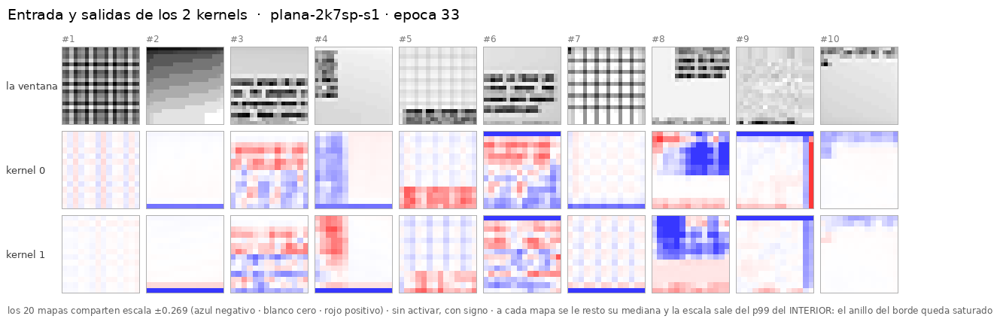

# `padding=0` de verdad: el 2k7 **sin relleno**, convolución *valid*

> **Copia de [`cnn-plana-2k7`](../2026-09-03-cnn-plana-2k7/) salvo el relleno de la convolución.**
> Misma geometría de vista, mismos 2 kernels 7×7, misma entrada de 2 canales, misma receta
> `plan40`, **misma semilla 1**, mismo dataset y **las mismas 10 ventanas**. Los stops caen en las
> mismas épocas (0, 3, 11, 24) para poder ponerlos uno al lado del otro.

**Corrido el 2026-09-03**, **0 máquinas alquiladas, 0 $** (22,8 min de reloj en este droplet).
⚠ **Paró solo en la época 33** de las 37 pedidas — `patience` — y su mejor época fue la **23**.

---

## 1. Qué lo distingue del gemelo, y qué arrastra

`nn.Conv2d(..., padding=0)`: no se rellena nada, así que **no hay anillo porque no hay relleno**.
Es el caso que el control de [`replicate`](../2026-09-03-cnn-plana-4k7-replicate/) **no** cubría:
aquél cambiaba *con qué* se rellena, éste **no rellena**.

```
x (2, 20, 20)
   → Conv2d(2 → 2, 7×7, stride 1, padding 0)     ← valid: 20 − 7 + 1 = 14
   → flatten (2·14·14 = 392) + los 4 escalares de borde
   → Linear(396 → 12)
```

| | 2k7 `zeros` | 2k7 sin relleno |
|---|---:|---:|
| salida de L1 | 20×20 | **14×14** |
| features a la cabeza | 800 | **392** |
| parámetros | 9.858 | **4.962** |

⚠⚠ **Y ese encogimiento es el confound de este experimento, no un detalle.** No rellenar
**obliga** a que la salida mengüe, así que la comparación con el gemelo mide *dos* cosas a la vez:
quitar el relleno **y** partir la cabeza por la mitad. Cualquier lectura que no lo diga está
atribuyendo al padding un efecto que puede ser del tamaño. El §3 lo acota con los tres puntos que
hay.

## 2. El resultado

| stop | 2k7 `zeros` | | | 2k7 **sin relleno** | | | |
|---|---:|---:|---:|---:|---:|---:|---|
| | `val_loss` | f1 | err | `val_loss` | f1 | err | |
| ép. 1 | 0,5426 | 0,079 | 3,84 px | 0,5963 | 0,067 | 4,22 px | |
| ép. 3 | 0,4322 | 0,462 | 3,21 px | 0,4831 | 0,320 | 3,43 px | |
| ép. 11 | 0,3805 | 0,639 | 3,07 px | 0,4092 | 0,595 | 3,13 px | |
| ép. 24 | 0,3371 | 0,725 | 2,79 px | 0,4017 | 0,639 | 3,13 px | |
| ép. 33 | 0,3427 | 0,740 | 2,86 px | 0,3944 | 0,658 | 3,15 px | ← aquí paró |
| **mejor del run** | **0,3130** *(ép. 36)* | **0,739** | 2,62 px | **0,3885** *(ép. 23)* | **0,656** | 3,04 px | |

**Pierde 0,083 de f1 y 0,076 de `val_loss`**, y además **satura antes**: su mejor época es la 23
—diez antes que el gemelo— y `patience` lo cortó en la 33.

⚠ La banda de oscilación de su `val_loss` en el último tramo (ép. ≥ 25) es **0,022**, así que la
diferencia de 0,076 está **muy por encima del ruido de un run**. Con **una semilla** eso acota,
no declara — pero no es un empate.

## 3. **El anillo desaparece, y con eso ya son dos formas independientes de quitarlo**

Misma receta de medida que en [`porque_el_anillo.py`](../2026-09-03-cnn-plana-4k7/nn/porque_el_anillo.py):
se resta a cada mapa el nivel mediano de su interior y se compara el anillo de `k//2 = 3` px
contra el resto.

| | anillo | interior | ratio |
|---|---:|---:|---:|
| 4k7 `zeros` | 0,741 | 0,079 | **9,43×** |
| 2k7 `zeros` | 0,833 | 0,072 | **11,62×** |
| 4k7 `replicate` | 0,113 | 0,052 | 2,17× |
| **2k7 sin relleno** | 0,075 | 0,035 | **2,15×** |

**`replicate` y `padding=0` caen los dos en ~2,2×**, por caminos distintos: uno rellena con el
píxel del borde, el otro no rellena. Que dos mecanismos independientes den el mismo residuo es la
mejor prueba disponible de que **ese ~2,2× que queda no es artefacto**: es el borde **real** de la
vista, que para una ventana que toca el final de la página es información que existe y que la
cabeza tiene que ver (es justo para lo que están los `edge_inputs`).

### Lo que se paga por quitarlo, puesto al lado de lo que cuesta encoger la cabeza

Tres puntos, todos con la misma semilla, receta y dataset:

| red | features a la cabeza | f1 (mejor) | Δ f1 contra el anterior |
|---|---:|---:|---:|
| 4k7 `zeros` | 1.600 | 0,840 | |
| 2k7 `zeros` | 800 | 0,739 | **−0,101** |
| 2k7 sin relleno | 392 | 0,656 | **−0,083** |

**Cada vez que se parte el número de features por la mitad se pierden ~0,09 de f1**, y la caída de
este experimento (−0,083) encaja en esa tendencia sin necesitar ningún efecto extra del padding.
⚠ **No es una descomposición, es una coincidencia numérica compatible con dos historias**: «quitar
el relleno es neutro y lo que duele es el tamaño» y «quitar el relleno duele y el tamaño menos».
Separarlas pide un run con `padding=0` y la cabeza compensada (más kernels, o `padding='same'` con
la vista recortada de antemano), y **no se ha hecho**.

Lo que sí queda establecido, junto con el control de `replicate`: **ninguna de las dos formas de
quitar el anillo compra f1.** El anillo es feo y es real, y arreglarlo no ha mejorado nada.

## 4. ⚠ Y de paso corrige una medida de los experimentos anteriores

El `abs_media` que guarda cada `resumen.json` está calculado sobre el **mapa entero**, y en las
redes con relleno de ceros ese mapa está dominado por el anillo. O sea que *«qué kernel responde
más»* estaba midiendo, en buena parte, *«qué kernel hace más anillo»*.

Se ve al recalcularlo sólo en el interior y sin el nivel
([`../comun/concentracion.py`](../comun/concentracion.py), que lee los `mapas.npy` ya guardados y
no reescribe ningún stop):

| red, época 37 | ratio sobre el mapa entero | ratio en el interior |
|---|---:|---:|
| 4k7 `zeros` | 7,5× | **4,3×** |
| 2k7 `zeros` | 8,5× | **2,2×** |
| 4k7 `replicate` | **16,6×** | **3,4×** |
| 2k7 sin relleno (ép. 33) | 1,3× | **1,0×** |

La fila de `replicate` es la que lo delata: **tiene menos anillo y sale con MÁS concentración**
sobre el mapa entero. Un número que se mueve al revés que el mecanismo que dice medir no está
midiendo eso.

**Qué cambia y qué no:**

- ⚠ **Cambia** la frase del §3 del gemelo *«la concentración pasa igual con 2 kernels que con 4»*.
  Con la medida limpia **no es igual**: 4 kernels concentran más (4,3×) que 2 (2,2×). Corregido
  allí.
- **No cambia** su conclusión, porque no dependía de ese número: quitar dos kernels cuesta 0,10 de
  f1, así que el kernel flojo no es capacidad desperdiciada. Ese argumento sigue en pie tal cual.
- **Es una lección repetida** del proyecto: una medida agregada sobre un mapa con un artefacto
  grande mide sobre todo el artefacto. Igual que en la sonda L1, donde el R² del Gabor pasaba su
  nulo sobre kernels **delta**.



## 5. El código es LOCAL — `src/fv/` no se toca

Instrucción del dueño (2026-09-03): *«estos son experimentos, nada tienen que ver con las redes
previas… Si hay que hacer cambios al código tendremos que copiarlo localmente»*. `builder.py`
calcula el relleno como `k//2` y no es un dato, así que esto no cabía en una config.

| | |
|---|---|
| [`nn/red_local.py`](nn/red_local.py) | `sin_relleno()` sustituye cada `Conv2d` por otro con `padding=0` **copiando sus pesos**, y `PlanaSinPadding` rehace la cabeza con el `flat` que resulte |
| [`nn/entrenar_local.py`](nn/entrenar_local.py) | parchea `fv.training.loop.build_model` **en memoria** y llama al CLI del repo (`fv-train`/`fv-continue`) sin duplicarlo |
| [`nn/evaluar_local.py`](nn/evaluar_local.py) | el mismo parche, y luego el evaluador **compartido** de [`../comun/`](../comun/) |

⚠ **Y lo comprueba al terminar cada corrida.** `_comprobar_intacto()` verifica que
`src/fv/models/builder.py` sigue teniendo `padding=pad` y que `build_model` no quedó pisado
globalmente. Un parche en memoria que se filtrara a producción sería exactamente el fallo
silencioso que esta separación existe para no cometer.

## 6. Qué hay aquí

| | |
|---|---|
| [`instrucciones/01-encargo.md`](instrucciones/01-encargo.md) | el encargo tal como llegó |
| [`nn/avances.sh`](nn/avances.sh) | la cadena de avances a los mismos stops |
| [`nn/red_local.py`](nn/red_local.py) · [`nn/entrenar_local.py`](nn/entrenar_local.py) · [`nn/evaluar_local.py`](nn/evaluar_local.py) | el código local |
| `evaluacion/stop-*/` | los cinco stops: los PNG por kernel, `mapas.npy`, `resumen.json` y tres figuras |
| `nn/pesos/` | **los pesos, en git** (`best.pt`, `last.pt` + config, métricas y resumen del run) |
| [`../comun/`](../comun/) | evaluador, set de 10 ventanas y entradas — **compartidos** con los otros tres |

## 7. Cómo se repite

```bash
cd ~/src/foveal-vision
E=experimentos/2026-09-03-cnn-plana-2k7-sinpadding
.venv/bin/python $E/nn/evaluar_local.py --stop 00-sin-entrenar          # la red SIN entrenar
.venv/bin/python $E/nn/entrenar_local.py nuevo --epochs 1
$E/nn/avances.sh                                                        # el resto, ~23 min
```

## 8. Lo que quedó pendiente

1. **El confound del tamaño de la cabeza sigue sin separar** (§3). Es lo primero si esta vía se
   retoma, y es un solo run.
2. **Una semilla.** La caída (0,076 de `val_loss`) supera la banda de ruido del propio run
   (0,022), pero con `n = 1` eso **acota, no declara**.
3. **Paró en la 33, no en la 37.** No es comparable época a época con los otros tres en su último
   stop; sí lo es en los stops 0-3, que son los que se pusieron uno al lado del otro.
4. **No se probó `padding=0` con 4 kernels**, que es el punto que haría del §3 una recta de tres
   puntos con dos relleno-cero y dos sin relleno.
