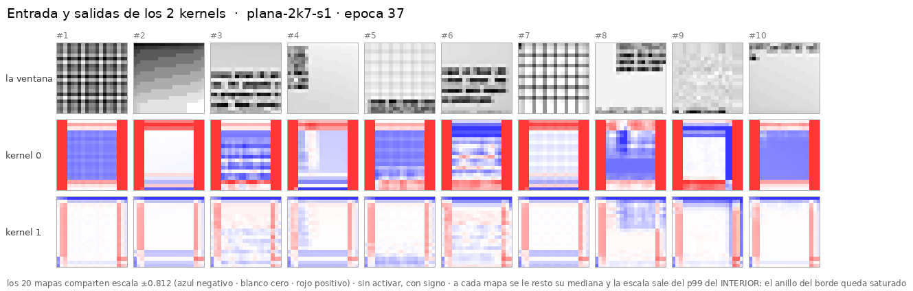

# CNN plana de 1 capa y 2 kernels 7×7 — el gemelo de [`cnn-plana-4k7`](../2026-09-03-cnn-plana-4k7/)

> **Idéntico a su gemelo salvo `channels: [4] → [2]`.** Misma geometría, misma entrada de 2
> canales, misma cabeza de 12 salidas, receta `plan40`, **semilla 1**, mismo dataset y **las
> mismas 10 ventanas** del set de visualización. Los stops caen en las **mismas épocas** (0, 3,
> 11, 24, 37) para poder ponerlos uno al lado del otro.

**Corrido el 2026-09-03.** 37 épocas, **24,7 min** en este droplet (2 vCPU). **0 máquinas
alquiladas, 0 $.** Config: [`configs/networks/plana-20-2k7.yaml`](../../configs/networks/plana-20-2k7.yaml).

---

## 1. La red

```
x (2, 20, 20)   ← la MISMA vista 20×20 + el MISMO canal de relleno
   → Conv2d(2 → 2, 7×7, stride 1, padding 3)      ← UNA capa, DOS kernels
   → flatten (800) + los 4 escalares de borde
   → Linear(804 → 12)                             ← 4 esquinas × [existe, x, y]
```

**9.858 parámetros**, la mitad que el gemelo (19.656). Todo el ahorro está en la cabeza: 800
features en vez de 1.600.

⚠ **Y arranca desde exactamente el mismo sitio.** Con la misma semilla, los dos kernels sin
entrenar de aquí son **los dos primeros** del gemelo (norma 0,538 y 0,594). No es una
coincidencia bonita: es lo que hace que la comparación empiece igualada.

## 2. El resultado: **2 kernels pierden en todos los stops**

| stop | 4 kernels | | | 2 kernels | | | brecha |
|---|---:|---:|---:|---:|---:|---:|---|
| | `val_loss` | f1 | err | `val_loss` | f1 | err | |
| ép. 1 | 0,5218 | 0,109 | 3,71 px | 0,5426 | 0,079 | 3,84 px | +0,021 · −0,031 |
| ép. 3 | 0,3749 | 0,582 | 2,89 px | 0,4322 | 0,462 | 3,21 px | +0,057 · −0,120 |
| **ép. 11** | 0,2691 | 0,792 | 2,44 px | 0,3805 | 0,639 | 3,07 px | **+0,111 · −0,154** |
| ép. 24 | 0,2397 | 0,827 | 2,28 px | 0,3371 | 0,725 | 2,79 px | +0,097 · −0,102 |
| ép. 37 | 0,2377 | 0,835 | 2,31 px | 0,3219 | 0,724 | 2,72 px | +0,084 · −0,112 |
| **mejor del run** | **0,2297** *(ép. 34)* | **0,840** | | **0,3130** *(ép. 36)* | **0,739** | | **+0,083 · −0,101** |

**Quitar dos kernels cuesta ~0,10 de f1 y ~0,08 de `val_loss`**, y el coste no se recupera con
más épocas: la brecha se abre hasta la época 11 y luego se queda plana. El error de posición
también empeora, de 2,28 a 2,72 px.

**Y no sale más barato**: 40,0 s/época contra 38,9 del gemelo. La mitad de parámetros no compra
tiempo porque el cuello no está ahí — está en cargar y componer las ventanas.

## 3. ⚠ Lo que este gemelo corrige de lo que se dijo del otro

En el experimento de 4 kernels se observó que **k1 se apagaba** (respuesta 8× menor que k3) y se
apuntó como posible lectura que *«la red está usando la mitad de su primera capa»*, con la idea
implícita de que 4 kernels pudieran sobrar. **El gemelo dice que no.**

Respuesta media por kernel en cada stop, y el ratio entre el más activo y el menos:

| stop | 4 kernels | ratio | 2 kernels | ratio |
|---|---|---:|---|---:|
| sin entrenar | 0,171 · 0,406 · 0,430 · 0,504 | 2,9× | 0,204 · 0,519 | 2,5× |
| ép. 3 | 0,339 · 0,222 · 0,303 · 0,459 | **2,1×** | 0,649 · 0,360 | **1,8×** |
| ép. 11 | 0,686 · 0,154 · 0,420 · 0,962 | 6,2× | 1,094 · 0,240 | 4,6× |
| ép. 24 | 0,838 · 0,142 · 0,432 · 1,125 | 7,9× | 1,297 · 0,169 | 7,7× |
| **ép. 37** | 0,811 · 0,147 · 0,436 · 1,096 | **7,5×** | 1,436 · 0,170 | **8,5×** |

**La concentración pasa igual con 2 kernels que con 4, y acaba en el mismo sitio** (7,5× y 8,5×).
En los dos, el ratio **baja** al principio —los kernels se reparten— y luego **crece de forma
monótona** desde la época 3.

Así que no es «sobran kernels»: es cómo entrena esta configuración. Y el gemelo añade la prueba
que faltaba — **con 2 kernels también se concentra, y además rinde peor**. Si el kernel apagado
fuera capacidad desperdiciada, quitarlo saldría gratis; cuesta 0,10 de f1.



Se ve directo: `kernel 0` lleva casi todo el trabajo y `kernel 1` apenas responde.

⚠ **Una semilla y 37 épocas: acota, no declara.** El reparto entre kernels puede depender de la
inicialización, y con `n = 1` no hay forma de saberlo desde aquí. Repetir los dos gemelos con 3
semillas cuesta ~2,5 h.

## 4. Qué hay aquí

| | |
|---|---|
| [`instrucciones/01-encargo.md`](instrucciones/01-encargo.md) | el encargo tal como llegó |
| [`nn/avances.sh`](nn/avances.sh) | la cadena de avances a los mismos stops (3 → 11 → 24 → 37), con su evaluación entre uno y otro |
| `evaluacion/stop-*/` | los cinco stops: 20 PNG, `mapas.npy`, `resumen.json` y tres figuras cada uno |
| [`../comun/`](../comun/) | **el evaluador, el set de 10 ventanas y las entradas — compartidos con el gemelo** |
| los pesos | **fuera de git**, en `foveal-vision-data/2026/09-septiembre/runs/plana-2k7-s1/` |

⚠ **Lo compartido está en `../comun/` a propósito.** Comparar los stops de los dos gemelos sólo
significa algo si la medida es **la misma**: mismo evaluador, mismas 10 ventanas, mismas
imágenes de entrada. Dos copias derivarían y la comparación se volvería una ilusión sin que nada
fallara.

## 5. Cómo se repite

```bash
cd ~/src/foveal-vision
E=experimentos/2026-09-03-cnn-plana-2k7
.venv/bin/python experimentos/comun/aplicar_kernels.py --exp $E --red plana-20-2k7 \
    --stop 00-sin-entrenar                          # la red SIN entrenar
.venv/bin/fv-train --name plana-2k7-s1 --window-dataset dirty1000-80px-16px-r20260827 \
    --network plana-20-2k7 --recipe plan40 --epochs 1
$E/nn/avances.sh                                    # el resto de stops, ~24 min
```

## 6. Lo que quedó pendiente

1. **Una semilla.** Es lo que más limita: el reparto entre kernels y la brecha de 0,10 de f1
   están medidos una sola vez. **Acota, no declara.**
2. **No se probó 1 kernel ni 8.** Con dos puntos (2 y 4) no se sabe si la curva satura, y ése es
   justo el eje que este par de experimentos abre.
3. **La receta es la de la foveada** y nadie la ha ajustado a una plana de una capa. La brecha
   podría estrecharse con otra `lr`.
4. **El anillo del borde sigue ahí**, y por el mismo motivo: el relleno de ceros de la
   convolución. Ver [el §3 del gemelo](../2026-09-03-cnn-plana-4k7/README.md), que lo mide y
   propone cuatro salidas — ninguna implementada.
