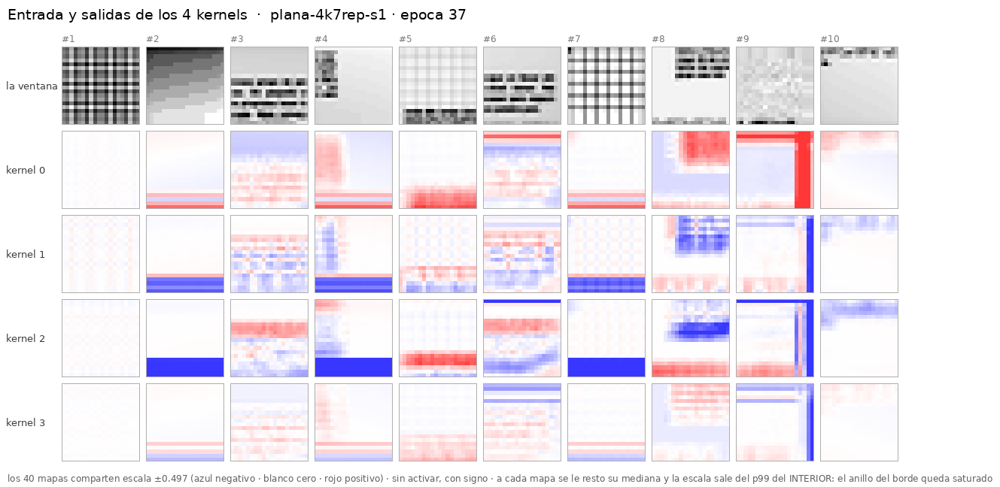

# Control: el mismo 4×7×7, con el relleno de la convolución en `replicate`

> **Idéntico a [`cnn-plana-4k7`](../2026-09-03-cnn-plana-4k7/) salvo `conv_pad_mode`.** Mismos
> 19.656 parámetros, misma geometría, misma receta, **misma semilla — pesos iniciales idénticos
> bit a bit** (norma de k0 = 0,5384 en los dos). Mismos stops: 0, 3, 11, 24, 37 épocas. La única
> variable es con qué rellena la convolución fuera del borde de la vista.

**Corrido el 2026-09-03**, 37 épocas, **0 máquinas, 0 $**.
Config: [`configs/networks/plana-20-4k7-rep.yaml`](../../configs/networks/plana-20-4k7-rep.yaml).

---

## 1. Qué preguntaba

En el experimento de 4 kernels salió un **anillo** de `k//2` px donde la respuesta es **9,4×** la
del interior, y está medido que sale del **relleno de ceros**: la vista es papel con valor ≈1 y
`nn.Conv2d` pone 0 fuera del borde. Como la vista es un recorte de una imagen **más grande**, esos
píxeles **existen**, así que ponerles cero sustituye contexto real por «no hay tinta» — la regla
falsa que `pad_mode: edge` evita (decisión C10).

El argumento parecía sólido. **Este run lo pone a prueba entrenando de cero con `replicate`.**

⚠ Porque lo que se había medido hasta aquí era otra cosa: que una red **ya entrenada** cambia si
le cambias el relleno **al inferir**. Eso mide sensibilidad, no daño. Sólo un run entrenado con el
otro valor contesta *«¿habría salido mejor?»*.

## 2. El resultado: **`replicate` NO mejora. Si acaso, empeora**

| stop | 4k7 `zeros` | | 4k7 `replicate` | | |
|---|---:|---:|---:|---:|---|
| | `val_loss` | f1 | `val_loss` | f1 | |
| ép. 1 | 0,5218 | 0,109 | 0,5547 | 0,082 | |
| ép. 3 | 0,3749 | 0,582 | 0,3928 | **0,596** | ← lo único que gana |
| ép. 11 | 0,2691 | 0,792 | 0,2787 | 0,790 | |
| ép. 24 | 0,2397 | 0,827 | 0,2673 | 0,814 | |
| ép. 37 | 0,2377 | 0,835 | 0,2684 | 0,815 | |
| **mejor del run** | **0,2297** *(ép. 34)* | **0,840** | 0,2525 *(ép. 33)* | 0,820 | |

**Y el anillo SÍ desaparece**, así que el mecanismo era el que se dijo — pero no era el problema:

| | anillo | interior | ratio |
|---|---:|---:|---:|
| `zeros`, época 37 | 0,741 | 0,079 | **9,43×** |
| `replicate`, época 37 | 0,113 | 0,052 | **2,17×** |

## 3. Cómo hay que leer esto

**El arreglo «obvio» no era una mejora.** Quitar el anillo baja el f1 de 0,840 a 0,820 y sube la
`val_loss` de 0,2297 a 0,2525.

⚠ **Y con la misma honestidad: la diferencia está DENTRO del ruido.** La banda de oscilación de
la `val_loss` medida en el propio run de `zeros` durante su último avance es **0,037**, y aquí la
diferencia es **0,023**. Con **una semilla** eso no declara que `replicate` sea peor. Lo que sí
declara, y es lo que se buscaba: **no es mejor.**

**La lección, que es la que vale fuera de aquí:** el argumento a favor de `replicate` era bueno
—contexto real en vez de «no hay tinta»— y aun así el número no lo respalda. El anillo es un
artefacto **visible** que la red aprende a descontar; la cabeza es una `Linear` sobre las 1.600
features y tiene de sobra para ignorar un patrón idéntico en todas las ventanas.

> **Que un defecto se vea en una figura no significa que cueste rendimiento.** El control existe
> justo para separar esas dos cosas, y aquí las separó.

### Qué implica para las redes de producción

**Nada, por ahora — y ése es el resultado.** El análisis del gemelo proponía cuatro salidas
ordenadas «A → B → decidir», siendo A *medirlo antes de tocar nada*. **A está hecho, y dice que
no hay nada que arreglar** por esta vía: con una semilla, cambiar el relleno no compra f1.

⚠ Falta el caso que este run **no** cubre: `padding=0` de verdad (convolución *valid*, sin anillo
porque no hay relleno). Es lo que mide
[`cnn-plana-2k7-sinpadding`](../2026-09-03-cnn-plana-2k7-sinpadding/).

## 4. Qué hay aquí

| | |
|---|---|
| [`instrucciones/01-encargo.md`](instrucciones/01-encargo.md) | el encargo tal como llegó |
| [`nn/avances.sh`](nn/avances.sh) | la cadena de avances a los mismos stops |
| `evaluacion/stop-*/` | los cinco stops |
| [`../comun/`](../comun/) | evaluador, set de 10 ventanas y entradas — **compartidos** con los demás |
| los pesos | **fuera de git**, en `foveal-vision-data/2026/09-septiembre/runs/plana-4k7rep-s1/` |

## 5. Lo que quedó pendiente

1. **Una semilla.** La diferencia (0,023) es menor que la banda de ruido (0,037), así que
   **acota, no declara**. Tres semillas por brazo cuestan ~2,5 h y convertirían «no mejora» en
   una afirmación con `p`.
2. **Sólo se probó en la plana de una capa.** En la foveada son **4 capas**, la contaminación
   entra 4 px por lado y toca el **64 %** de las celdas de la periferia — mucho más que aquí. Que
   no importe con una capa no dice que no importe con cuatro.
3. **`reflect` y `circular` no se probaron.** El campo los admite; nadie los ha medido.
