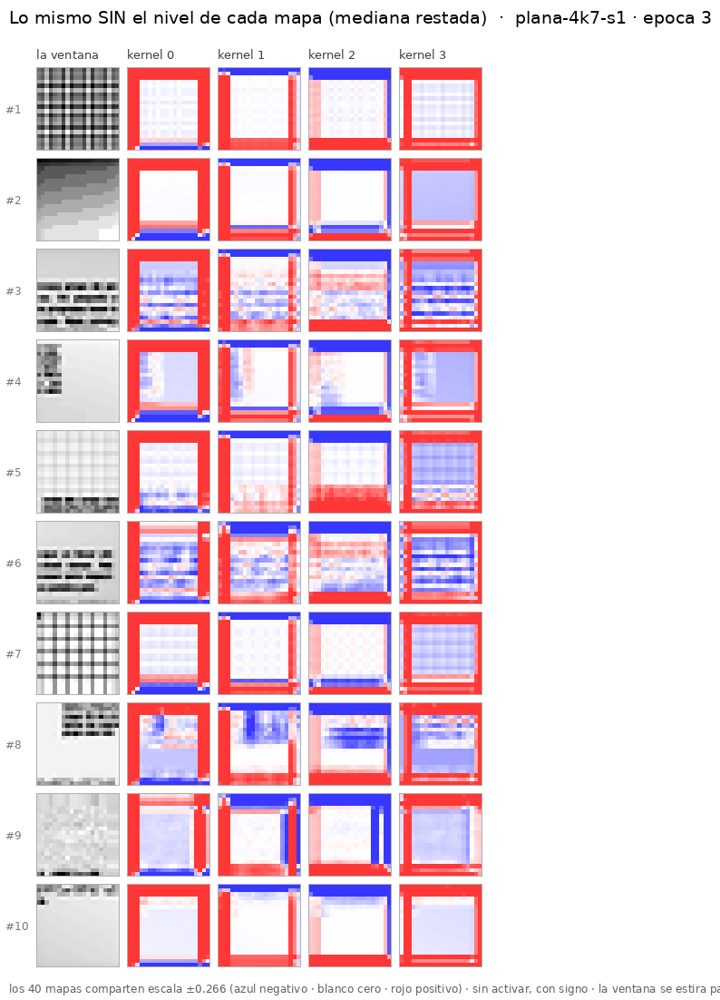

# CNN plana de 1 capa y 4 kernels 7×7 — misma entrada y salida que la foveada

**Encargo del 2026-09-03** ([`instrucciones/01-encargo.md`](instrucciones/01-encargo.md)).
Entrenamiento **en curso, por avances**. Primer avance hecho: **3 épocas, 112,7 s** en este
droplet (2 vCPU). **0 máquinas alquiladas, 0 $.**

---

## 1. La red

Misma **entrada** y misma **salida** que `fov16-optimo-mask`; lo único distinto es la estructura
de en medio. Config: [`configs/networks/plana-20-4k7.yaml`](../../configs/networks/plana-20-4k7.yaml).

```
x (2, 20, 20)   ← la MISMA vista 20×20 + el MISMO canal de relleno
   → Conv2d(2 → 4, 7×7, stride 1, padding 3)      ← UNA capa, CUATRO kernels
   → (sin ReLU: es la última capa, y el repo la deja con signo a propósito)
   → flatten (1.600) + los 4 escalares de borde
   → Linear(1604 → 12)                            ← 4 esquinas × [existe, x, y]
```

| | foveada `fov16-optimo-mask` | esta plana |
|---|---|---|
| regiones | `split` (fovea + periferia, con máscaras) | **`single`** (una rama, sin máscaras) |
| capas | 4 | **1** |
| kernels por capa | 16 | **4** |
| tamaño de kernel | 3×3 | **7×7** |
| entrada | 20×20, 2 canales en la periferia | **20×20, 2 canales** |
| salida | 12 | **12** |
| parámetros | 168.044 | **19.656** |

**Receta: `plan40`** — los parámetros óptimos **de la foveada** (`lr` 0,0014, adam, `batch` 85,
`patience` 10, semilla 1). ⚠ Nadie los ha ajustado a una plana de una capa; se usan porque un
punto de partida medido vale más que uno inventado, y porque es lo que pidió el dueño.

## 2. Los avances, y que se pueden añadir épocas

Lo pedía el encargo explícitamente, y **funciona con los comandos que ya existían**:

```bash
fv-train    --name plana-4k7-s1 --window-dataset dirty1000-80px-16px-r20260827 \
            --network plana-20-4k7 --recipe plan40 --epochs 1
fv-continue --name plana-4k7-s1 --more 2        # ← añade épocas al run YA entrenado
```

`fv-continue` reanuda desde `last.pt` y **continúa la curva**, no la reinicia: restaura el
estado del optimizador y el RNG del barajado, así que la época 2 no vuelve a ver el orden de la 1.

| avance | épocas | reloj | `val_loss` | f1 | err. posición |
|---|---:|---:|---:|---:|---:|
| `fv-train --epochs 1` | 1 | 37,5 s | 0,5218 | 0,109 | 3,71 px |
| `fv-continue --more 2` | 2 → 3 | 75,2 s | **0,3749** | **0,582** | **2,89 px** |

**Total: 3 épocas, 112,7 s ≈ 1,9 min** — el «~2 minutos» que pedía el encargo.
*(la foveada de referencia está en f1 0,954 y 1,05 px, con 8,5× los parámetros y 4 capas)*

⚠ **La foveada tiene 168.044 parámetros, no los 168.844 que dicen otros documentos del repo.**
Lo cazó el `verificador` el 2026-09-03: ese número sale de `network_trace`, que cuenta
`state_dict().values()` en vez de `parameters()`, así que suma los **dos buffers de máscara** de
20×20 (400 + 400 = 800) que **no se aprenden**. Con `regions: single` no hay máscaras, así que
en la plana los dos métodos coinciden — y comparar los dos números tal cual le regalaba 800
parámetros a la foveada. **El bug de `network_trace` es anterior a este experimento**
(`builder.py:338`, commit `5432c9c15`) y **no lo he tocado**: ese número está citado en varios
sitios y cambiarlo de tapadillo desalinearía la documentación. Queda dicho para que lo decidas.

**Los pesos están en `foveal-vision-data/2026/09-septiembre/runs/plana-4k7-s1/`** (`best.pt` para
evaluar, `last.pt` para continuar). ⚠ **Sin commitear a propósito**: el encargo dice «guarda los
pesos localmente… no hace falta commit hasta que yo te indique». Lo que **sí** entra en git son
las salidas de la evaluación.

## 3. La evaluación de este experimento

⚠ **No se evalúa la salida típica de la red.** El encargo lo dice: lo que se mira es la
**entrada pasada por los kernels** — 4 imágenes por cada imagen de entrada.

- **El set de visualización son 10 ventanas de validación**, elegidas al azar **una vez** y
  congeladas en [`evaluacion/set-visualizacion.json`](evaluacion/set-visualizacion.json). Se
  reusan en todos los stops: dos stops sólo son comparables sobre las mismas entradas.
- **Se evalúa antes de entrenar y en cada stop.** El `stop-00` es la red **sin entrenar**, y es
  *la misma* red que luego entrena: la init se reproduce con la semilla de la receta, y está
  **comprobado** que construir los datasets en medio no consume el RNG global.

| stop | qué | dónde |
|---|---|---|
| `00-sin-entrenar` | red recién inicializada | [`evaluacion/stop-00-sin-entrenar/`](evaluacion/stop-00-sin-entrenar/) |
| `01-3epocas` | tras el primer avance (~2 min) | [`evaluacion/stop-01-3epocas/`](evaluacion/stop-01-3epocas/) |

Cada stop trae **40 PNG** (`entradaNN-kernelJ.png`), `mapas.npy` con los valores crudos,
`resumen.json` y dos montajes.

```bash
python nn/aplicar_kernels.py --stop 00-sin-entrenar               # red sin entrenar
python nn/aplicar_kernels.py --stop 02-Nepocas --run plana-4k7-s1  # tras el siguiente avance
```

### Qué se ve, tras 2 minutos



**Los kernels ya cogen las líneas de texto** — se ve en las entradas #3, #6 y #8 (líneas
horizontales), en la #4 (el canto vertical del bloque) y en la #9 (textura sin estructura). Y
**k2 pasó de media 0,93 a 0,023** en `|suma|/L2`, o sea que ya es un filtro de media cero. Con 3
épocas eso es un principio, no un resultado.

⚠ **Hay DOS montajes, y el crudo engaña.** `montaje.png` es la salida tal cual y sale como
placas planas de color. No es un fallo del pintado: está **medido** que el nivel constante de
cada mapa es **8,2× la estructura del texto** (0,300 contra 0,037), así que con una escala común
el rizo que interesa es invisible. `montaje-sin-nivel.png` le resta a cada mapa su mediana y
toma la escala del **p99 del interior** — el anillo de 3 px queda saturado a propósito.

**Tres hipótesis que probé para explicar el marco, y las dos primeras eran falsas:**

| hipótesis | medida | veredicto |
|---|---|---|
| domina el canal de **relleno** | el 90-97 % de la respuesta viene de la **vista** | ❌ |
| domina el **DC** del kernel | `|suma|/L2` entre 0,02 y 1,27, con máximo posible 7 | ❌ *(mal criterio: ver abajo)* |
| **el nivel constante aplasta la escala** | nivel 0,300 contra estructura 0,037 → **8,2×** | ✅ |

El nivel **sí** nace de la media del kernel multiplicada por un papel casi uniforme, así que la
segunda hipótesis era correcta en el mecanismo — la rechacé con el criterio equivocado
(`|suma|/L2` contra su máximo teórico, cuando lo que decide es nivel **contra rizo**).
Y el anillo del borde aporta poco: el marco es **1,18×** el interior con padding de ceros y
**1,08×** con `replicate`.

## 4. Qué hay aquí

| | |
|---|---|
| [`instrucciones/01-encargo.md`](instrucciones/01-encargo.md) | el encargo tal como llegó (commit `9926bd0b2`) |
| [`nn/aplicar_kernels.py`](nn/aplicar_kernels.py) | la evaluación: congela el set, aplica los kernels, guarda las 40 imágenes y los montajes |
| `evaluacion/stop-*/` | un directorio por stop |
| los pesos | **fuera de git**, en `foveal-vision-data/2026/09-septiembre/runs/plana-4k7-s1/` |

## 5. Lo siguiente — pendiente de tu decisión

El encargo dice avisarte al terminar el primer avance para decidir si seguimos con pasos de
2 min o los alargamos. **Ahí está.** A 37,5 s/época:

| paso | épocas | acumulado |
|---|---:|---:|
| 2 min | +3 | 6 |
| 5 min | +8 | 11 |
| 15 min | +24 | 27 |
| 30 min | +48 | 51 |

Un paso se lanza con `fv-continue --name plana-4k7-s1 --more N` y luego
`python nn/aplicar_kernels.py --stop 02-<N>epocas --run plana-4k7-s1`.

⚠ **Y un aviso sobre `patience`:** la receta trae `patience: 10`, así que si en algún avance
pasan 10 épocas sin mejorar la `val_loss`, el run **para solo** antes de agotar las épocas
pedidas. Con avances cortos no ha llegado a pasar; en un paso de 30 min puede. Se cambia sólo
para esa continuación con `fv-continue --patience 0` (sin early-stop).
