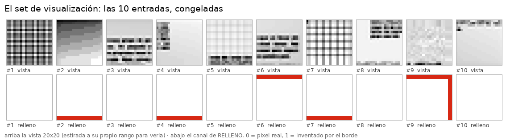

# CNN plana de 1 capa y 4 kernels 7×7 — misma entrada y salida que la foveada

**Encargo del 2026-09-03** ([`instrucciones/01-encargo.md`](instrucciones/01-encargo.md)).
Entrenamiento **en curso, por avances**. Hechos cuatro: **37 épocas, 24,1 min** en este droplet
(2 vCPU). **0 máquinas alquiladas, 0 $.**

---

## 1. La red

Misma **entrada** y misma **salida** que `fov16-optimo-mask`; lo único distinto es la estructura
de en medio. Config: [`configs/networks/plana-20-4k7.yaml`](../../configs/networks/plana-20-4k7.yaml).

```
x (2, 20, 20)   ← la MISMA vista 20×20 + el MISMO canal de relleno
   → Conv2d(2 → 4, 7×7, stride 1, padding 3)      ← UNA capa, CUATRO kernels
   → (sin ReLU: es la última capa, y el repo la deja con signo a propósito)
   → flatten (1.600) + los 4 escalares de borde
   → Linear(1604 → 12)                            ← 4 esquinas × [existe, x, y]
```

| | foveada `fov16-optimo-mask` | esta plana |
|---|---|---|
| regiones | `split` (fovea + periferia, con máscaras) | **`single`** (una rama, sin máscaras) |
| capas | 4 | **1** |
| kernels por capa | 16 | **4** |
| tamaño de kernel | 3×3 | **7×7** |
| entrada | 20×20, 2 canales en la periferia | **20×20, 2 canales** |
| salida | 12 | **12** |
| parámetros | 168.044 | **19.656** |

**Receta: `plan40`** — los parámetros óptimos **de la foveada** (`lr` 0,0014, adam, `batch` 85,
`patience` 10, semilla 1). ⚠ Nadie los ha ajustado a una plana de una capa; se usan porque un
punto de partida medido vale más que uno inventado, y porque es lo que pidió el dueño.

## 2. Los avances, y que se pueden añadir épocas

Lo pedía el encargo explícitamente, y **funciona con los comandos que ya existían**:

```bash
fv-train    --name plana-4k7-s1 --window-dataset dirty1000-80px-16px-r20260827 \
            --network plana-20-4k7 --recipe plan40 --epochs 1
fv-continue --name plana-4k7-s1 --more 2        # ← añade épocas al run YA entrenado
```

`fv-continue` reanuda desde `last.pt` y **continúa la curva**, no la reinicia: restaura el
estado del optimizador y el RNG del barajado, así que la época 2 no vuelve a ver el orden de la 1.

| avance | épocas | reloj | `val_loss` | f1 | err. posición |
|---|---:|---:|---:|---:|---:|
| `fv-train --epochs 1` | 1 | 37,5 s | 0,5218 | 0,109 | 3,71 px |
| `fv-continue --more 2` | 2 → 3 | 75,2 s | 0,3749 | 0,582 | 2,89 px |
| `fv-continue --more 8` | 4 → 11 | 5 min 05 s | 0,2691 | 0,792 | 2,44 px |
| `fv-continue --more 13` | 12 → 24 | 8 min 42 s | 0,2397 | 0,827 | 2,28 px |
| `fv-continue --more 13` | 25 → 37 | 8 min 24 s | **0,2297** *(ép. 34)* | **0,844** *(ép. 36)* | **2,22 px** |

**Total: 37 épocas, 24,1 min.** El primer avance fue el «~2 minutos» que pedía el encargo; los
otros tres los eligió el dueño.

### ⚠ La mejora ya es MÁS PEQUEÑA QUE EL RUIDO

| avance | épocas | Δ `val_loss` | Δ f1 | por época |
|---|---:|---:|---:|---|
| 2º | 8 | **−0,106** | +0,210 | −0,0133 |
| 3º | 13 | −0,029 | +0,035 | −0,0022 |
| **4º** | 13 | **−0,010** | +0,017 | **−0,0008** |

El rendimiento por época ha caído **17×** desde el segundo avance. Y en el cuarto la `val_loss`
oscila entre **0,2297 y 0,2663** — una banda de **0,037**, que es **casi cuatro veces** lo que ha
mejorado en todo el avance. Cada época nueva mueve el número más por dónde cae el barajado que
por aprendizaje.

⚠ **Y la mejor época ya no es la última**: la mejor `val_loss` es la **34** (0,2297) y el run
acabó en la **37** (0,2377). O sea que `best.pt` ≠ `last.pt`, y **`patience` está a 3 de 10** —
siete épocas más sin mejorar y el próximo avance para solo.

⚠ **Los stops evalúan `last.pt`, no `best.pt`**, y desde este avance eso importa: `stop-04` es la
época **37**, no la 34. Es lo correcto para «cómo va el entrenamiento» —es el estado desde el que
se continúa— pero no es el mejor modelo del run.
*(la foveada de referencia está en f1 0,954 y 1,05 px, con 8,5× los parámetros y 4 capas)*

⚠ **La foveada tiene 168.044 parámetros, no los 168.844 que dicen otros documentos del repo.**
Lo cazó el `verificador` el 2026-09-03: ese número sale de `network_trace`, que cuenta
`state_dict().values()` en vez de `parameters()`, así que suma los **dos buffers de máscara** de
20×20 (400 + 400 = 800) que **no se aprenden**. Con `regions: single` no hay máscaras, así que
en la plana los dos métodos coinciden — y comparar los dos números tal cual le regalaba 800
parámetros a la foveada. **El bug de `network_trace` es anterior a este experimento**
(`builder.py:338`, commit `5432c9c15`) y **no lo he tocado**: ese número está citado en varios
sitios y cambiarlo de tapadillo desalinearía la documentación. Queda dicho para que lo decidas.

**Los pesos están en `foveal-vision-data/2026/09-septiembre/runs/plana-4k7-s1/`** (`best.pt` para
evaluar, `last.pt` para continuar). ⚠ **Sin commitear a propósito**: el encargo dice «guarda los
pesos localmente… no hace falta commit hasta que yo te indique». Lo que **sí** entra en git son
las salidas de la evaluación.

## 3. La evaluación de este experimento

⚠ **No se evalúa la salida típica de la red.** El encargo lo dice: lo que se mira es la
**entrada pasada por los kernels** — 4 imágenes por cada imagen de entrada.

- **El set de visualización son 10 ventanas de validación**, elegidas al azar **una vez** y
  congeladas en [`evaluacion/set-visualizacion.json`](evaluacion/set-visualizacion.json). Se
  reusan en todos los stops: dos stops sólo son comparables sobre las mismas entradas.
- **Se evalúa antes de entrenar y en cada stop.** El `stop-00` es la red **sin entrenar**, y es
  *la misma* red que luego entrena: la init se reproduce con la semilla de la receta, y está
  **comprobado** que construir los datasets en medio no consume el RNG global.

| qué | dónde |
|---|---|
| **las 10 entradas** | [`evaluacion/entradas/`](evaluacion/entradas/) |
| `stop-00-sin-entrenar` — red recién inicializada | [`evaluacion/stop-00-sin-entrenar/`](evaluacion/stop-00-sin-entrenar/) |
| `stop-01-3epocas` — tras el primer avance (~2 min) | [`evaluacion/stop-01-3epocas/`](evaluacion/stop-01-3epocas/) |
| `stop-02-11epocas` — tras el segundo avance (+8 épocas) | [`evaluacion/stop-02-11epocas/`](evaluacion/stop-02-11epocas/) |
| `stop-03-24epocas` — tras el tercero (+13 épocas, ~8 min) | [`evaluacion/stop-03-24epocas/`](evaluacion/stop-03-24epocas/) |
| `stop-04-37epocas` — tras el cuarto (+13 épocas, ~8 min) | [`evaluacion/stop-04-37epocas/`](evaluacion/stop-04-37epocas/) |

### Las entradas



`evaluacion/entradas/` trae `entradaNN.png` (la vista 20×20) y `entradaNN-relleno.png` (el
segundo canal), más la hoja de arriba. **Están fuera de los `stop-*/` a propósito**: el set está
congelado, así que son idénticas en todos los stops — copiarlas en cada uno invitaría a creer que
pueden cambiar entre uno y otro, que es justo lo que no puede pasar para que dos stops se
comparen.

⚠ **Se guardan los DOS canales porque la red ve los dos.** El de relleno es `1 − cobertura`:
0 = píxel real, 1 = inventado por `pad_mode: edge`. Y sale un dato del sorteo que conviene tener
delante al leer los mapas: **5 de las 10 ventanas tocan el borde de la imagen** (#2, #4, #6, #7 y
la #9, que toca dos a la vez). En esas, parte de lo que responde el kernel es relleno, no imagen.

Cada stop trae **40 PNG** (`entradaNN-kernelJ.png`), `mapas.npy` con los valores crudos,
`resumen.json` y **tres** figuras:

| figura | para qué |
|---|---|
| **`entrada-y-salidas.png`** | **la de revisar**: una columna por entrada y una fila por kernel, como `entradas.png`. «Qué hace el kernel 2 en las diez» se lee recorriendo **una** fila |
| `montaje.png` | la salida **cruda**, entradas en filas. ⚠ Sale como placas planas de color: ver el aviso de abajo |
| `montaje-sin-nivel.png` | lo mismo que el montaje, con la mediana de cada mapa restada |

⚠ **Un stop es una foto en el tiempo, y `--run` lee siempre `last.pt`.** Volver a correr la
etiqueta de un stop viejo después de seguir entrenando lo **reescribe con los pesos de hoy**.
Pasó el 2026-09-03 al añadir la tira: `stop-01-3epocas` quedó con los pesos de la época 11
—montaje y tira idénticos a los del `stop-02`— y sólo se notó porque dos ficheros tenían
exactamente el mismo tamaño. Se recuperó de git. Ahora:

- el script **se niega** si la etiqueta del stop ya existe con otro modelo (hace falta `--rehacer`);
- **`--solo-figuras`** rehace las figuras de un stop viejo **desde su `mapas.npy`**, sin tocar la
  red. El artefacto de registro de un stop es su `mapas.npy`; las figuras son **derivadas**.

```bash
python nn/aplicar_kernels.py --stop 00-sin-entrenar                # red sin entrenar
python nn/aplicar_kernels.py --stop 03-Nepocas --run plana-4k7-s1  # tras el siguiente avance
python nn/aplicar_kernels.py --stop 01-3epocas --solo-figuras      # rehacer figuras de un stop viejo
```

### Qué se ve, tras 37 épocas


**Los kernels cogen las líneas de texto** — claro en las entradas #3, #6 y #8, y el canto
vertical del bloque en la #4 y la #9.

**Y los cuatro kernels se están repartiendo el trabajo**, que es lo que más se ve al comparar
stops:

| | k0 | k1 | k2 | k3 |
|---|---:|---:|---:|---:|
| norma L2 · ép. 3 | 0,845 | 0,735 | 0,771 | 0,847 |
| norma L2 · ép. 11 | 1,274 | 0,743 | 0,976 | 1,485 |
| norma L2 · **ép. 24** | **1,554** | 0,852 | 1,113 | **1,869** |
| \|respuesta\| media · ép. 3 | 0,339 | 0,222 | 0,303 | 0,459 |
| \|respuesta\| media · ép. 11 | 0,686 | 0,154 | 0,420 | 0,962 |
| \|respuesta\| media · ép. 24 | 0,838 | 0,142 | 0,432 | 1,125 |
| norma L2 · **ép. 37** | **1,685** | 1,014 | 1,151 | **2,020** |
| \|respuesta\| media · **ép. 37** | **0,811** | **0,147** | 0,436 | **1,096** |

**El reparto se ha consolidado, no revertido.** k0 y k3 siguen creciendo (respuesta ×2,5 y ×2,5
desde la época 3) y **k1 sigue apagándose**: su norma sube un poco —0,735 → 0,852— pero su
respuesta **baja otra vez**, de 0,154 a 0,142, o sea **−36 %** desde la época 3. k2 se ha quedado
plano desde la 11 (0,420 → 0,432).

⚠ **En la práctica quedan dos kernels y medio, y el patrón AGUANTA.** De la época 24 a la 37 las
respuestas están congeladas (k0 0,838 → 0,811; k1 0,142 → 0,147; k2 0,432 → 0,436; k3 1,125 →
1,096) aunque las **normas siguen creciendo**. O sea: los pesos se hacen más grandes y la
respuesta no cambia — el reparto es estable. **k3 responde 7,5× más que k1.** Con sólo 4 kernels,
la red está usando la mitad de su primera capa.

⚠ Con una semilla y 24 épocas esto **acota, no declara**.

⚠ **Hay DOS montajes, y el crudo engaña.** `montaje.png` es la salida tal cual y sale como
placas planas de color. No es un fallo del pintado: está **medido** que el nivel constante de
cada mapa es **8,2× la estructura del texto** (0,300 contra 0,037), así que con una escala común
el rizo que interesa es invisible. `montaje-sin-nivel.png` le resta a cada mapa su mediana y
toma la escala del **p99 del interior** — el anillo de 3 px queda saturado a propósito.

**Tres hipótesis que probé para explicar el marco, y las dos primeras eran falsas:**

| hipótesis | medida | veredicto |
|---|---|---|
| domina el canal de **relleno** | el 90-97 % de la respuesta viene de la **vista** | ❌ |
| domina el **DC** del kernel | `|suma|/L2` entre 0,02 y 1,27, con máximo posible 7 | ❌ *(mal criterio: ver abajo)* |
| **el nivel constante aplasta la escala** | nivel 0,300 contra estructura 0,037 → **8,2×** | ✅ |

El nivel **sí** nace de la media del kernel multiplicada por un papel casi uniforme, así que la
segunda hipótesis era correcta en el mecanismo — la rechacé con el criterio equivocado
(`|suma|/L2` contra su máximo teórico, cuando lo que decide es nivel **contra rizo**).
Y el anillo del borde aporta poco: el marco es **1,18×** el interior con padding de ceros y
**1,08×** con `replicate`.

## 4. Qué hay aquí

| | |
|---|---|
| [`instrucciones/01-encargo.md`](instrucciones/01-encargo.md) | el encargo tal como llegó (commit `9926bd0b2`) |
| [`nn/aplicar_kernels.py`](nn/aplicar_kernels.py) | la evaluación: congela el set, aplica los kernels, guarda las 40 imágenes y los montajes |
| [`evaluacion/entradas/`](evaluacion/entradas/) | las 10 entradas en PNG: vista y canal de relleno |
| `evaluacion/stop-*/` | un directorio por stop |
| los pesos | **fuera de git**, en `foveal-vision-data/2026/09-septiembre/runs/plana-4k7-s1/` |

## 5. Lo siguiente — pendiente de tu decisión

El encargo dice avisarte al terminar el primer avance para decidir si seguimos con pasos de
2 min o los alargamos. **Ahí está.** A 37,5 s/época:

| paso | épocas | acumulado |
|---|---:|---:|
| 2 min | +3 | 14 |
| 5 min | +8 | 19 |
| 15 min | +24 | 35 |
| 30 min | +48 | 59 |

Un paso se lanza con `fv-continue --name plana-4k7-s1 --more N` y luego
`python nn/aplicar_kernels.py --stop 03-<N>epocas --run plana-4k7-s1`.

⚠ **Y un aviso sobre `patience`:** la receta trae `patience: 10`, así que si en algún avance
pasan 10 épocas sin mejorar la `val_loss`, el run **para solo** antes de agotar las épocas
pedidas. Con avances cortos no ha llegado a pasar; en un paso de 30 min puede. Se cambia sólo
para esa continuación con `fv-continue --patience 0` (sin early-stop).
