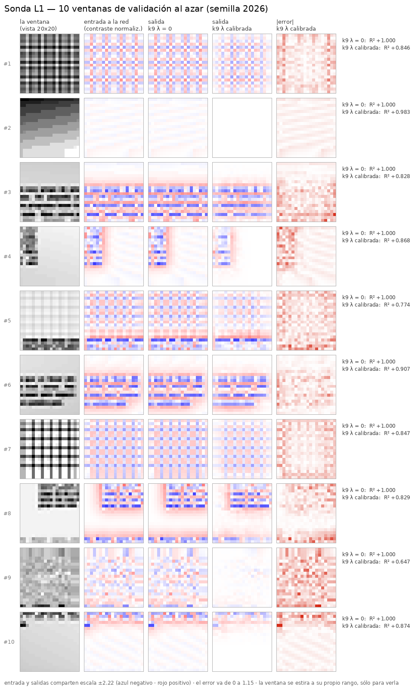

# Entrada contra salida: 10 ventanas al azar

`nn/reconstruir.py` · 10 ventanas de **validación** elegidas al azar con semilla **2026**,
dataset `dirty1000-80px-16px-r20260827`. Reproducible: mismo comando, mismos números.

```bash
../../.venv/bin/python nn/reconstruir.py            # 10 ventanas, semilla 2026
../../.venv/bin/python nn/reconstruir.py --n 6 --semilla 7
```



## Cómo se lee

La sonda es un **autoencoder**: su salida *es* la reconstrucción de su entrada. Las columnas son
la ventana original, lo que ve la red (contraste normalizado), lo que devuelve cada brazo, y el
error del brazo calibrado.

| | R² medio | activación media |
|---|---:|---:|
| **k9 λ = 0** | **+1,000** | 68,6 % |
| **k9 λ calibrada** | **+0,840** | 4,4 % |

## ⚠ El que reconstruye perfecto es el que NO aprendió

**Mira las columnas 2 y 3: son la misma imagen.** El brazo λ=0 devuelve su entrada **píxel a
píxel** en las 10 ventanas, R² = 1,000 en todas. No es que reconstruya bien: es que aprendió la
**identidad**. Sus kernels son deltas —σ del Gabor ajustado 0,49 px contra 1,41 de un kernel
aleatorio— y tiene 9 de 16 canales encendidos el 99,97 % del tiempo. Copia.

**El brazo calibrado reconstruye peor, y eso es lo interesante.** Con el código forzado a ser
disperso (4,4 % de activación, 16 canales vivos, 0 muertos) tiene que elegir qué guardar:

- **conserva** las líneas de texto marcadas (ventanas #3, #6, #8) — la estructura fuerte
  sobrevive;
- **descarta** la textura de fondo y el ruido fino. La peor reconstrucción es la **#9**
  (R² +0,647), que es justo la ventana sin texto legible: sólo textura;
- **la #2 está casi en blanco y su activación es 0,0 %**: ningún canal se enciende. Un código
  disperso no tiene nada que decir de un parche vacío, y eso es correcto.

**Lo que la figura enseña sobre «cuánto ha aprendido»:** con presión real conserva bordes y
líneas y tira lo demás. Es un codificador **razonable**, pero sus kernels **no son filtros
genéricos orientados** — ésa era la pregunta del experimento, y la respuesta sigue siendo **no**
(ver el `README.md` del experimento, §3).

## ⚠ Dos avisos para no leer de más

1. **El R² se divide por la varianza FIJA del train** (0,3066), que es la que usó la pérdida —
   no por la varianza de cada ventana. Así que una ventana casi vacía saca un R² alto **por estar
   vacía**, no por estar bien reconstruida. Es el caso de la **#2** (+0,983).
2. **La columna «la ventana» se estira a su propio rango** para poder verla; la red **no** ve
   eso, ve la columna de al lado. Es una decisión de pintado y está anotada en el pie.

`resultados.json` trae por ventana: R² total, R² del interior (sin el anillo de `k//2` px que el
decodificador reconstruye viendo ceros), activación y canales activos.
