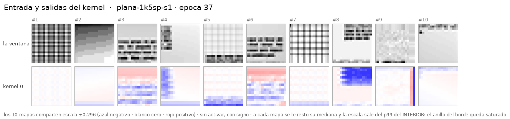

# UN kernel **5×5**, sin relleno — manda el tamaño de la cabeza, no el campo receptivo

> **Copia de [`cnn-plana-1k7-sinpadding`](../2026-09-04-cnn-plana-1k7-sinpadding/) salvo
> `k_center: 7 → 5`.** Mismo `padding=0`, misma geometría de vista, misma receta `plan40`,
> **misma semilla 1**, mismo dataset y **las mismas 10 ventanas**. Mismos stops (0, 3, 11, 24, 37).

**Corrido el 2026-09-04**, 37 épocas, **20,2 min** en este droplet (2 vCPU) — **el más rápido de
los seis**. **0 máquinas alquiladas, 0 $.**
Config: [`configs/networks/plana-20-1k5.yaml`](../../configs/networks/plana-20-1k5.yaml).

---

## 1. ⚠⚠ Qué preguntaba, y por qué mueve DOS cosas a la vez

Sin relleno, un kernel más pequeño **recorta menos**. Así que bajar de 7×7 a 5×5 no deja la red
igual: le **agranda** la cabeza.

| | mapa (valid) | features | L1 | campo receptivo | total |
|---|---|---:|---:|---:|---:|
| 1k**7** sin relleno | 14×14 | 196 | 99 params | 7 px | 2.511 |
| 1k**5** sin relleno | 16×16 | **256** | **51 params** | **5 px** | 3.183 |

Los dos efectos empujan **en sentidos opuestos**: **+31 % de features** (que por la tendencia de
la serie debería *subir* el f1 ≈ **+0,035**) contra **la mitad de capacidad en L1 y 5 px de campo
en vez de 7** (que debería *bajarlo*, en una cantidad que nadie ha medido).

**Eso no es un defecto del diseño: es lo que le permite decidir cuál de los dos manda.**
Separarlos pediría dejar el relleno puesto —y entonces vuelve el anillo y se pierde la
comparabilidad con toda la serie—. Se eligió mantener la comparación y **declarar el confound**,
que es lo que dice el [criterio congelado](instrucciones/02-criterio.md).

## 2. El resultado, contra el criterio **congelado antes de que terminara ninguno de los dos**

El criterio se escribió con el 7×7 en la época **22 de 37**, sin conocer su mejor f1, y por eso
está en relativo: sea **F₇** el mejor f1 del 7×7, se predijo **F₇ + 0,035**, banda **0,04**.

|  | |
|---|---|
| F₇ medido | **0,618** |
| rango predicho | **`[0,613 – 0,693]`** |
| **f1 del 5×5, medido** | **0,642** |

> ### **Dentro. Veredicto: manda el número de features.**

**Bajar el campo receptivo de 7 px a 5 px no costó nada medible.** Con la tendencia sola se
esperaba +0,035 y salió **+0,024**; la diferencia (0,011) está muy por debajo de la banda de
ruido, así que **lo que la serie estaba midiendo todo este tiempo es el tamaño de la cabeza**, no
la capacidad de la primera capa.

Y hay una segunda lectura que sale gratis:

| red | features | parámetros | mejor f1 | s/época |
|---|---:|---:|---:|---:|
| 2k7 sin relleno | 392 | 4.962 | 0,656 | 41,5 s |
| **1k5 sin relleno** | **256** | **3.183** | **0,642** | **32,8 s** |

**Con el 64 % de los parámetros y el 79 % del reloj, se queda a 0,014 de f1** — dentro de la banda
de ruido (0,039 medida en el propio run del 2k7). Los dos son indistinguibles con `n = 1`.

### La tabla completa

| stop | 1k7 sin relleno | | | 1k5 sin relleno | | |
|---|---:|---:|---:|---:|---:|---:|
| | `val_loss` | f1 | err | `val_loss` | f1 | err |
| ép. 1 | 0,6528 | 0,030 | 4,55 px | 0,5923 | 0,100 | 4,35 px |
| ép. 3 | 0,5406 | 0,200 | 3,97 px | 0,5243 | 0,384 | 4,01 px |
| ép. 11 | 0,4581 | 0,524 | 3,53 px | 0,4508 | 0,595 | 3,44 px |
| ép. 24 | 0,4262 | 0,609 | 3,39 px | 0,4110 | 0,635 | 3,22 px |
| ép. 37 | 0,4232 | 0,624 | 3,35 px | 0,3949 | 0,651 | 3,14 px |
| **mejor del run** | 0,4182 *(ép. 36)* | 0,618 | 3,32 px | **0,3922** *(ép. 36)* | **0,642** | **3,11 px** |

El 5×5 va por delante **en todos los stops**, y desde el primero (0,100 contra 0,030 en la época 1).

## 3. La serie entera: la tendencia de «~0,09 por mitad» **se desacelera**

```bash
.venv/bin/python experimentos/comun/serie.py
```

| red | features | mejor f1 | Δ contra el doble de features |
|---|---:|---:|---:|
| 4k7 `zeros` | 1.600 | 0,840 | — |
| 4k7 `replicate` | 1.600 | 0,820 | *(control del relleno, no una mitad)* |
| 2k7 `zeros` | 800 | 0,739 | **−0,101** |
| 2k7 sin relleno | 392 | 0,656 | −0,083 ⚠ *(mueve también el relleno)* |
| 1k7 sin relleno | 196 | 0,618 | **−0,038** |
| **1k5 sin relleno** | **256** | **0,642** | — *(no hay red con 512)* |

**0,101 → 0,083 → 0,038.** La «recta de ~0,09 por mitad» era una recta ajustada a una curva sobre
un tramo corto: al bajar, cada mitad cuesta menos. Con 196 features todavía se llega a **0,618**,
que es el **74 %** del f1 de una red con 8× más features.

⚠ **Una semilla en cada punto: acota, no declara.** Lo que sostiene la lectura es que la
dirección es consistente en los tres pasos, no un punto contra su umbral.

## 4. El kernel es un promediador — igual que el de 7×7

[`nn/que_es_el_kernel.py`](nn/que_es_el_kernel.py):

```
  canal         energia   DC (suma)  |DC|/norma     6-D   /nulo
  la vista       61.6%     +1.7597       2.815   0.410   1.71x
   DC 0.317  Sobel-x 0.000  Sobel-y 0.032  lapl. 0.000  diag-1 0.000  diag-2 0.061
    -> sin el DC: 0.093 contra un nulo de 0.200 = 0.47x
```

**El 32 % de su energía está en la componente constante**, y quitando el DC queda en **0,47× el
azar**. Es el mismo desenlace que en el 7×7 (24 % de DC, 0,33× sin él): con un solo filtro, lo
que la red aprende es **densidad de tinta local**, no orientación. Que salga igual con dos
tamaños de kernel distintos es lo más parecido a una réplica que hay aquí.

⚠ Y el 6-D **agregado** da 1,71×, que no llega a su p95 (1,91×) — o sea que en este caso ni
siquiera engaña. El del 7×7 sí lo pasaba (2,24×) **siendo DC puro**, y por eso el desglose vive
en el script y no en una nota al pie.



## 5. ⚠ Lo que costó lanzarlo: `notify.mjs` + `Restart=on-failure` = 62 reinicios

**La cadena terminó bien** —37 épocas y los 5 stops— y **después** entró en un bucle. El comando
desacoplado acababa en `node notify.mjs "…"`, y a una unidad de systemd **no le viajan los
secretos** (es deliberado: `sudo` escribiría `BOT_TOKEN` en claro en el journal). Así que:

```
[notify] Falta BOT_TOKEN: no hay a dónde avisar.     ← sale con ≠ 0
set -e            → la cadena entera sale con ≠ 0
Restart=on-failure → systemd la relanza
                  → re-evalúa stop-00, y `crear` falla con `run_exists` (código 62)
                  → vuelve a empezar…                 62 veces
```

**No corrompió nada** —comprobado stop a stop: los cinco `resumen.json` con su época correcta y
los pesos vivos casando con el último—, porque re-evaluar la red sin entrenar es idempotente y
`crear` se niega a sobrescribir. Pero quemó CPU y podría haber mordido en una cadena menos
defensiva.

> **La lección, que es una regla que ya estaba escrita y se incumplió aquí:** el aviso es una
> **comodidad**, la fuente de verdad es el artefacto en disco. Si el aviso puede tumbar el
> trabajo, deja de ser una comodidad. En un comando desacoplado va **siempre** así:
>
> ```sh
> node "$COORD_HOME/scripts/notify.mjs" "…" || true
> ```

Anotado en el CLAUDE.md del coordinador, que es donde viven las dos piezas.

## 6. Qué hay aquí

| | |
|---|---|
| [`instrucciones/01-encargo.md`](instrucciones/01-encargo.md) | el encargo, y por qué se corrió **a continuación** y no en paralelo (medido: 122 % de CPU en 2 vCPU) |
| [`instrucciones/02-criterio.md`](instrucciones/02-criterio.md) | **el criterio, congelado con el 7×7 en la época 22 de 37** |
| [`nn/red_local.py`](nn/red_local.py) · [`nn/entrenar_local.py`](nn/entrenar_local.py) · [`nn/evaluar_local.py`](nn/evaluar_local.py) | el código local; `src/fv/` no se toca |
| [`nn/que_es_el_kernel.py`](nn/que_es_el_kernel.py) | el §4, con su nulo y su desglose |
| `nn/pesos/` | **los pesos, en git** |
| `evaluacion/stop-*/` | los cinco stops |
| [`../comun/`](../comun/) | evaluador, 10 ventanas, `serie.py`, `cargar_pesos.py`, `concentracion.py` |

## 7. Cómo se repite

```bash
cd ~/src/foveal-vision
E=experimentos/2026-09-04-cnn-plana-1k5-sinpadding
.venv/bin/python $E/nn/evaluar_local.py --stop 00-sin-entrenar
.venv/bin/python $E/nn/entrenar_local.py crear --epochs 1
$E/nn/avances.sh                                    # ~20 min
```

## 8. Lo que quedó pendiente

1. **Una semilla**, en éste y en los cinco anteriores. Toda la serie **acota y no declara**.
2. **Los dos ejes siguen juntos.** Que «manda el número de features» está apoyado en que la
   diferencia contra la predicción (0,011) es muy inferior al ruido, no en un run que los separe.
   Separarlos de verdad pide recortar la vista de antemano, y **no está hecho**.
3. **`k` = 3 no se probó**, y es el valor que usa la foveada de producción. Sería el siguiente
   punto del eje y da 18×18 = 324 features.
4. **Nadie ha probado a quitar L1 entera.** Los dos kernels de un solo filtro salen promediadores;
   sustituirlos por un `avg_pool` fijo, sin parámetros, contestaría si L1 aporta algo aquí.
5. **La receta es la de la foveada** y nadie la ha ajustado a una plana de una capa.
