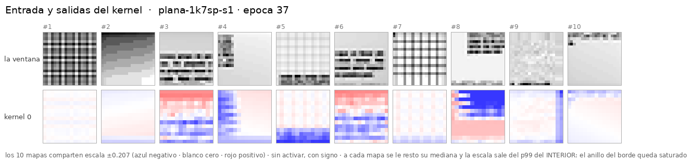

# UN solo kernel 7×7, sin relleno — y la tendencia de la serie **no continúa**

> **Copia de [`cnn-plana-2k7-sinpadding`](../2026-09-03-cnn-plana-2k7-sinpadding/) salvo
> `channels: [2] → [1]`.** Mismo `padding=0` de verdad, misma geometría de vista, misma receta
> `plan40`, **misma semilla 1**, mismo dataset y **las mismas 10 ventanas**. Los stops caen en las
> mismas épocas (0, 3, 11, 24, 37).

**Corrido el 2026-09-04**, 37 épocas, **22,1 min** en este droplet (2 vCPU). **0 máquinas
alquiladas, 0 $.** Config: [`configs/networks/plana-20-1k7.yaml`](../../configs/networks/plana-20-1k7.yaml).

---

## 1. La red

```
x (2, 20, 20)
   → Conv2d(2 → 1, 7×7, stride 1, padding 0)     ← UN kernel, valid: 20 − 7 + 1 = 14
   → flatten (1·14·14 = 196) + los 4 escalares de borde
   → Linear(200 → 12)
```

**2.511 parámetros**, de los cuales **99 son L1** (el kernel entero) y el resto la cabeza.

⚠ **Y arranca exactamente donde los otros.** Con la misma semilla, este kernel sin entrenar es
**bit a bit el k0** de los experimentos de 2 y de 4 (norma 0,5384). Es lo que hace que la
comparación empiece igualada, y `nn/red_local.py --comprobar` lo verifica.

## 2. El resultado, contra el criterio **congelado antes de correr**

El [criterio](instrucciones/02-criterio.md) predijo **f1 ≈ 0,57** con banda **0,04**, o sea el
rango `[0,53 – 0,61]`, extrapolando la tendencia de *«~0,09 de f1 por cada mitad de features»*
que dejó escrita el gemelo de 2 kernels.

> ### Medido: **0,618** — **0,008 por encima del borde superior de la banda.**

Por la letra del criterio eso es *«la tendencia se rompe por arriba»*. ⚠ Pero cae **al borde**, y
decir «se rompe» sin más sería exagerar 0,008. Lo que sí soporta el número, y con holgura, es lo
otro que el criterio pedía mirar:

| paso | features | f1 | Δ por esa mitad |
|---|---:|---:|---:|
| 4k7 `zeros` → 2k7 `zeros` | 1.600 → 800 | 0,840 → 0,739 | **−0,101** |
| 2k7 `zeros` → 2k7 sin relleno | 800 → 392 | 0,739 → 0,656 | −0,083 ⚠ *(también quita el relleno)* |
| **2k7 sin relleno → 1k7 sin relleno** | **392 → 196** | **0,656 → 0,618** | **−0,038** |

**La caída de este paso es MENOS DE LA MITAD de la que predecía la tendencia, y está DENTRO de la
banda de ruido (0,04)** — o sea que ni siquiera se distingue de «no cuesta nada».

**Y las tres caídas se desaceleran: 0,101 → 0,083 → 0,038.** La «recta de ~0,09 por mitad» era
una recta ajustada a una curva sobre un tramo corto. ⚠ Con **una semilla** esto acota y no
declara — pero la dirección es consistente en los tres pasos, no un punto suelto.

⚠ **Y el paso de en medio sigue siendo el sucio**: mueve features **y** relleno a la vez. Los
otros dos son limpios (sólo `channels`), y son justo los dos que más se separan entre sí.

### La tabla completa

| stop | 2k7 sin relleno | | | 1k7 sin relleno | | |
|---|---:|---:|---:|---:|---:|---:|
| | `val_loss` | f1 | err | `val_loss` | f1 | err |
| ép. 1 | 0,5963 | 0,067 | 4,22 px | 0,6528 | 0,030 | 4,55 px |
| ép. 3 | 0,4831 | 0,320 | 3,43 px | 0,5406 | 0,200 | 3,97 px |
| ép. 11 | 0,4092 | 0,595 | 3,13 px | 0,4581 | 0,524 | 3,53 px |
| ép. 24 | 0,4017 | 0,639 | 3,13 px | 0,4262 | 0,609 | 3,39 px |
| ép. 37 | — *(paró en la 33)* | | | 0,4232 | 0,624 | 3,35 px |
| **mejor del run** | **0,3885** *(ép. 23)* | **0,656** | 3,04 px | **0,4182** *(ép. 36)* | **0,618** | 3,32 px |

Y **llegó a la 37 sin que `patience` lo cortara**, a diferencia del gemelo (que paró en la 33):
con menos capacidad, la `val_loss` sigue mejorando más tiempo.

## 3. ⚠ ¿QUÉ es ese único kernel? — la pregunta que 2 y 4 no dejaban hacer limpia

Con varios kernels, la forma de cada uno se puede explicar por el reparto: *«uno hace bordes
porque otro hace manchas»*. **Con uno no hay reparto que invocar**, así que su forma es
directamente lo que la tarea necesita. Lo mide
[`nn/que_es_el_kernel.py`](nn/que_es_el_kernel.py), reusando el yardstick de la sonda L1
(`fv.probe.metrics.classic_basis`, importado, no copiado).

```
  canal         energia   DC (suma)  |DC|/norma     6-D   /nulo
  la vista       58.6%     +2.1954       3.438   0.275   2.24x
  el relleno     41.4%     -0.9380       1.746   0.085   0.70x
```

**Sobre el papel, un éxito**: 2,24× su nulo empírico, por encima del p95 (1,97×). Sería la
primera vez en este repo que un kernel de L1 pasa esa barra — la foveada de producción da 1,03×,
indistinguible del azar.

> ### ⚠⚠ Y es falso, porque la base 6-D **incluye el DC**.

```
   DC 0.241  Sobel-x 0.001  Sobel-y 0.000  lapl. 0.004  diag-1 0.003  diag-2 0.026
    -> sin el DC: 0.034 contra un nulo de 0.102 = 0.33x
```

**Toda la «riqueza» es DC.** Quitándolo, el kernel queda en **0,33× el azar**: está *menos*
alineado con los filtros derivativos clásicos que un kernel aleatorio. `|DC|/norma` = 3,438 sobre
un máximo de 7 significa que **el 24 % de su energía está en la componente constante**.

**Lo que la red aprende con un solo filtro es un medidor de densidad de tinta local**, no un
detector de bordes. Y tiene sentido: con `padding=0`, un mapa 14×14 y una `Linear` detrás, lo más
útil que puede hacer un único filtro es decir *cuánta tinta hay aquí*; la geometría la pone la
cabeza.

> **Es la misma lección del [reporte #22](https://github.com/stalinbeltran/estudios-redes-neuronales/blob/main/reportes/estudios/2026/09-septiembre/2026-09-03-sonda-l1-tanteo-eje-k.md), y por eso el desglose está en el script y no en una nota.**
> Allí el R² del Gabor pasaba su nulo sobre kernels **delta**; aquí el 6-D pasa el suyo sobre un
> **promediador**. Una métrica agregada con el nulo bien puesto sigue pudiendo ser engañada por
> una degeneración de la familia que mide. **Hay que desglosar, no sólo comparar contra el nulo.**



## 4. Qué hay aquí

| | |
|---|---|
| [`instrucciones/01-encargo.md`](instrucciones/01-encargo.md) | el encargo tal como llegó |
| [`instrucciones/02-criterio.md`](instrucciones/02-criterio.md) | **el criterio, congelado antes de la primera época** |
| [`nn/red_local.py`](nn/red_local.py) · [`nn/entrenar_local.py`](nn/entrenar_local.py) · [`nn/evaluar_local.py`](nn/evaluar_local.py) | el código local: `src/fv/` no se toca, y cada corrida lo comprueba |
| [`nn/que_es_el_kernel.py`](nn/que_es_el_kernel.py) | el análisis del §3, con su nulo y su desglose |
| `nn/pesos/` | **los pesos, en git** (`best.pt`, `last.pt` + config, métricas y resumen) |
| `evaluacion/stop-*/` | los cinco stops: los PNG, `mapas.npy`, `resumen.json` y tres figuras |
| [`../comun/`](../comun/) | evaluador, set de 10 ventanas, `serie.py` y `cargar_pesos.py` — **compartidos** |

## 5. Cómo se repite

```bash
cd ~/src/foveal-vision
E=experimentos/2026-09-04-cnn-plana-1k7-sinpadding
.venv/bin/python $E/nn/evaluar_local.py --stop 00-sin-entrenar    # la red SIN entrenar
.venv/bin/python $E/nn/entrenar_local.py crear --epochs 1
$E/nn/avances.sh                                                  # el resto, ~22 min
.venv/bin/python $E/nn/que_es_el_kernel.py                        # el §3
.venv/bin/python experimentos/comun/serie.py                      # la serie entera
```

## 6. Lo que quedó pendiente

1. **Una semilla.** La caída de −0,038 está **dentro** de la banda de ruido, así que «la
   tendencia se desacelera» **acota y no declara**. Tres semillas por punto lo cerrarían.
2. **El veredicto cayó a 0,008 del borde de la banda.** Un criterio que se decide por 0,008 no
   decide gran cosa; lo que sostiene la conclusión es la **serie** de tres caídas, no este punto
   contra su umbral.
3. **No se probó 1 kernel CON relleno**, que daría 400 features con la misma L1 y separaría
   «cabeza» de «relleno» en este extremo de la serie.
4. **El kernel es un promediador, y eso invita a una pregunta que no se hace aquí**: si lo que
   L1 aporta es densidad de tinta, ¿cuánto se pierde sustituyéndola por un `avg_pool` fijo, sin
   parámetros? Es un experimento de una tarde y contestaría si L1 aporta *algo* en esta plana.
